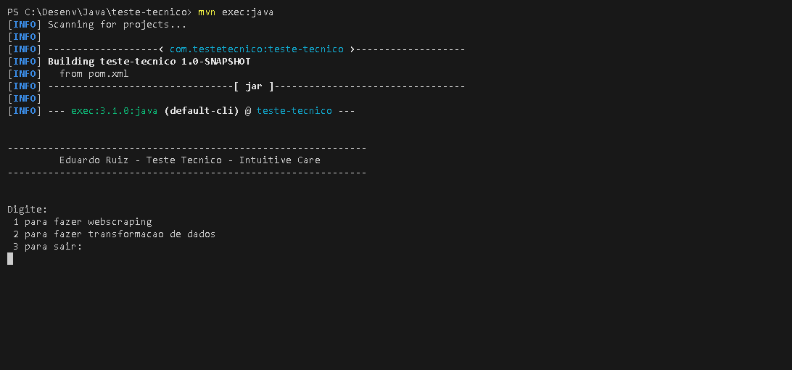
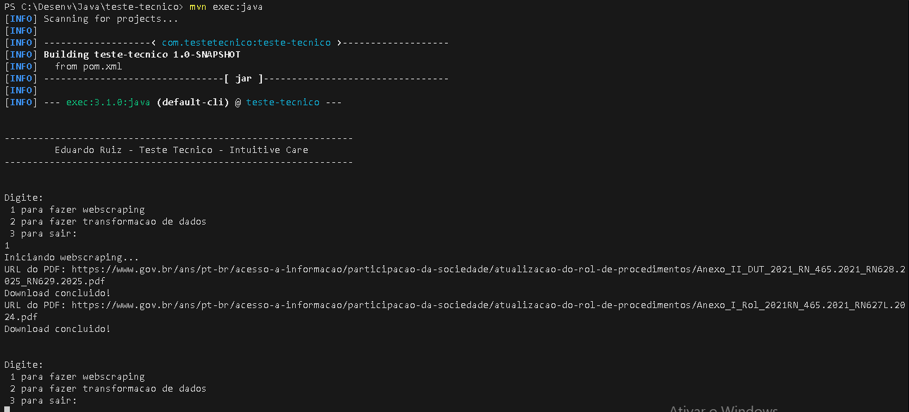
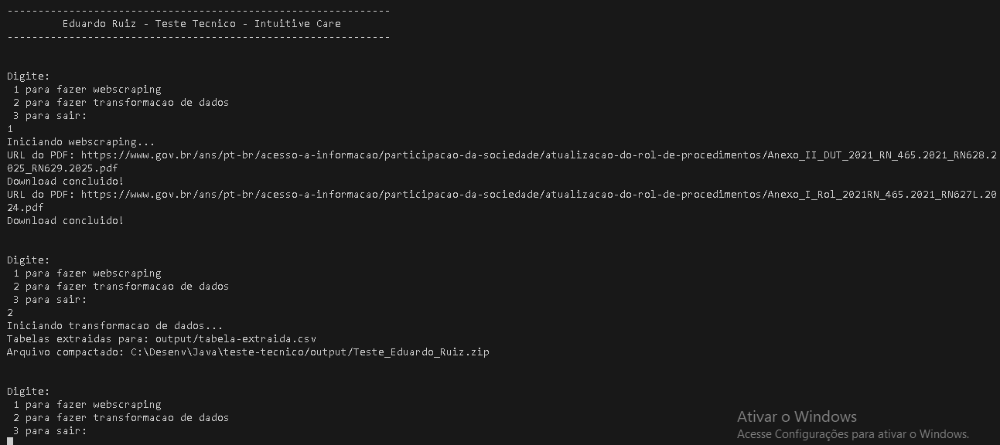

# WebScrapping Java

Este projeto é parte de um teste de WebScrapping em Java

## Pré-requisitos

- Sistema operacional: **Windows**
- [Java 11+](https://www.oracle.com/java/technologies/javase-jdk11-downloads.html) instalado
- [Apache Maven](https://maven.apache.org/) instalado e configurado no PATH

## Como executar o projeto

1. Faça o build do projeto:
   ```bash
   mvn clean install
   ```

2. Execute o projeto:
   ```bash
   mvn exec:java
   ```

## Prints do funcionamento do código
### Tela principal

### Web Scrapping

### Transformação de dados

